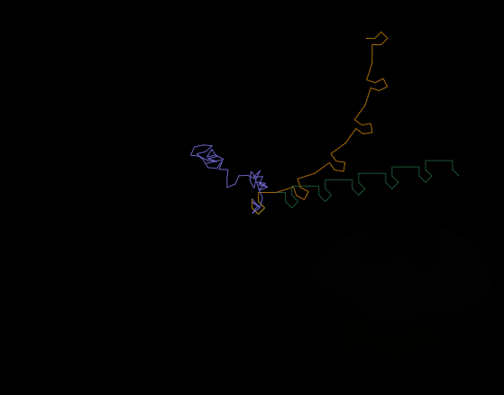
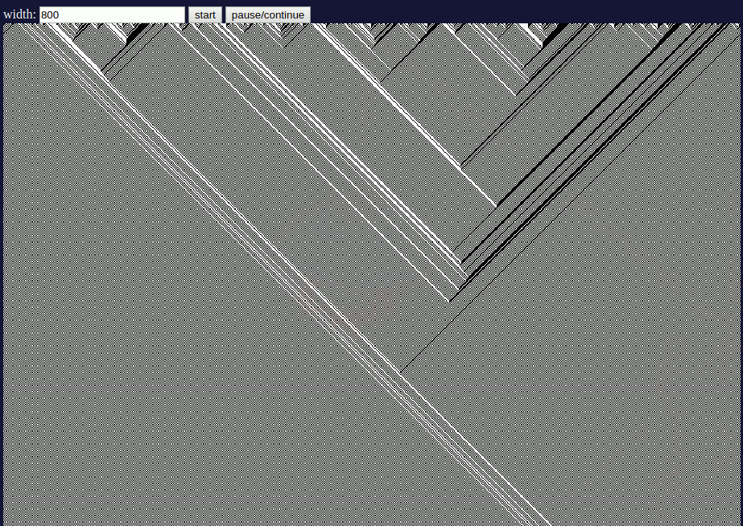
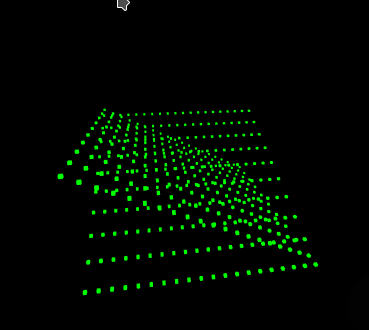
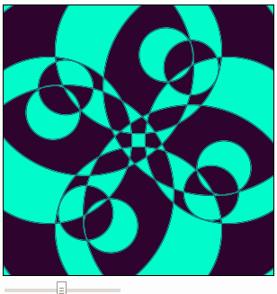
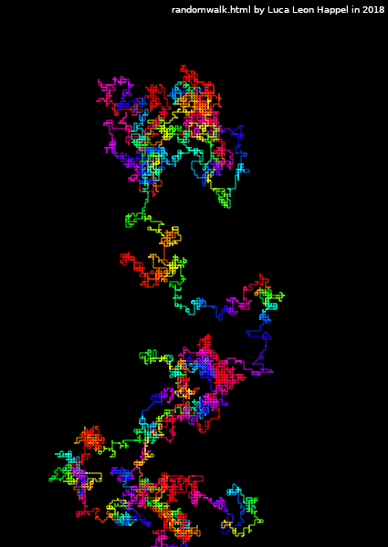
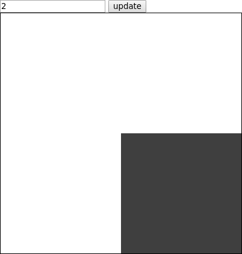
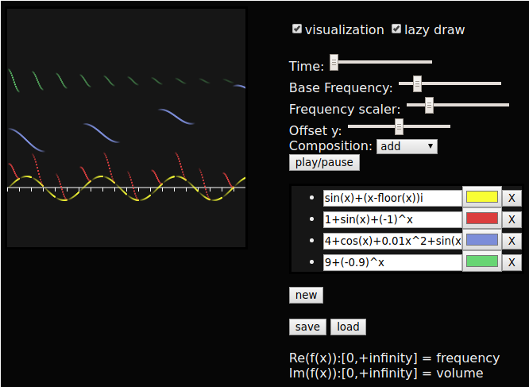
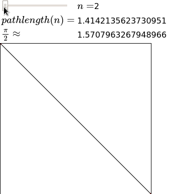
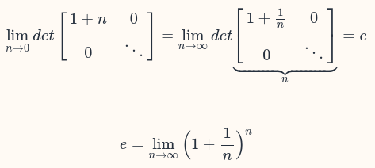
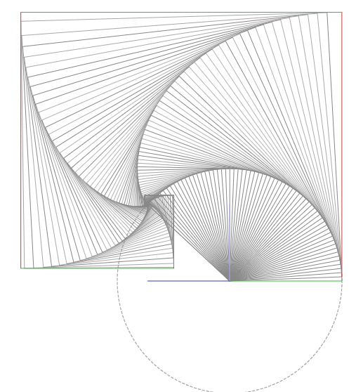

A collection of small mathematical programs written by me (Luca Leon Happel) [https://quoteme.github.io/math/](https://quoteme.github.io/math/)

### Projects:

* [intervalRun.html](https://quoteme.github.io/math/intervalRun.html)

	

* [184.html](https://quoteme.github.io/math/184.html)

	

* [3dPointMapping.html](https://quoteme.github.io/math/3dPointMapping.html)

	

* [3dPointMapping_adv.html](https://quoteme.github.io/math/3dPointMapping_adv.html)

	

* [cyclicCellularAutomation.html](https://quoteme.github.io/math/cyclicCellularAutomation.html)

	

* [kreise.html](https://quoteme.github.io/math/kreise.html)

	

* [randomwalk.html](https://quoteme.github.io/math/randomwalk.html)

	

* [restring.html](https://quoteme.github.io/math/restring.html)

	

* [mathemusik/index.html](https://quoteme.github.io/math/mathemusik/index.html)

	

* [pi.html](https://quoteme.github.io/math/pi.html)

	

* [e.html](https://quoteme.github.io/math/e.html)

	

* [powerseries_sin.html](https://quoteme.github.io/math/powerseries_sin.html)

	
